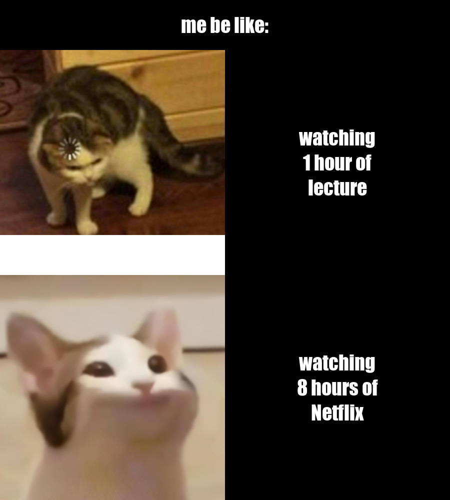

# Welcome to my Stats220 repo page
In this page you will see the meme I created using R code and the [{magick}](https://cran.r-project.org/web/packages/magick/vignettes/intro.html) package.

## Some cats and memes... 


### About this meme
* This meme was made originally by me, I found two intresting cat images using Google and turned it into a meme using R by adding some texts and blank spaces.
* This meme was inspired by a post I saw on Weibo which was about "me doing homework for 10 mins VS me playing vedio games for 10 hrs". I found it quite interesting, so I added cat images and a bit of my own idea to make it more relatable to myself. 

### Code
```
#import packge
library(magick)

#create meme
#image sources
confused_cat <- image_read("https://i.redd.it/py33ke03f8241.png") %>%
  image_scale(450)

pop_cat <- image_read("https://popcat.click/twitter-card.jpg") %>%
  image_scale(450)

#text sources
text1 <- image_blank(width = 450, height = 450, color = "#000000") %>%
  image_annotate(text = "me watching\n1 hour of\nlecture", color = "#FFFFFF", size = 40, font = "Impact", gravity = "center")

text2 <- image_blank(width = 450, height = 450, color = "#000000") %>%
  image_annotate(text = "me watching\n8 hours of\nNetflix", color = "#FFFFFF", size = 40, font = "Impact", gravity = "center")

#row 1
row_1 <- c(confused_cat, text1) %>%
  image_append()

#row 2
row_2 <- c(pop_cat, text2) %>%
  image_append()

#final meme
my_meme <- c(row_1, row_2) %>%
  image_append(stack = TRUE)

#save meme
image_write(my_meme, "my_meme.png")
```
